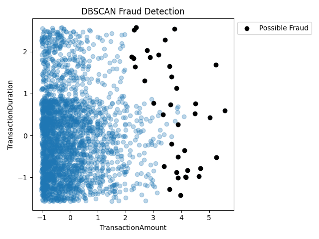
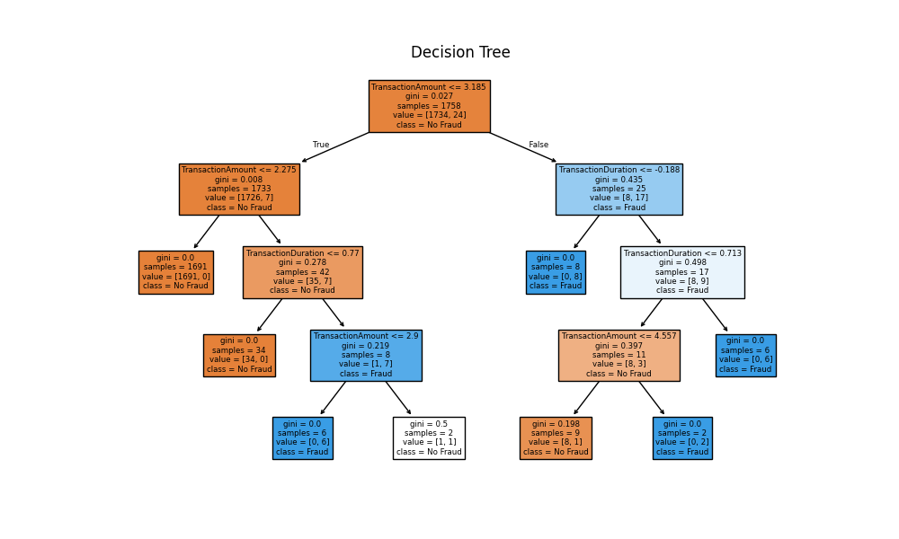
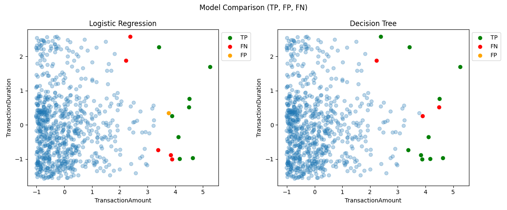

# Bank Fraud Detection using Machine Learning

## Project Overview

This project focuses on detecting potentially fraudulent banking transactions using a combination of unsupervised and supervised machine learning techniques.

The workflow begins with anomaly detection through DBSCAN, which is used to identify unusual transaction patterns and generate fraud labels. These labels are then used to train and evaluate Logistic Regression and Decision Tree classifiers.

---

## Dataset

The dataset contains 2,512 banking transactions and includes information related to transaction behavior, customer demographics, and account activity.

### Variables used in this project

- TransactionAmount
- TransactionDuration

---

## Methodology

### 1. Data Preprocessing

- Selection of relevant variables
- Missing value handling
- Standardization using StandardScaler

### 2. Fraud Detection

- DBSCAN anomaly detection
- Identification of potential fraudulent transactions

### 3. Supervised Learning

- Logistic Regression
- Decision Tree

### 4. Model Evaluation

- Confusion Matrix
- Accuracy
- Precision
- Recall
- F1-Score

---

## Technologies Used

- Python
- Pandas
- NumPy
- Scikit-Learn
- Matplotlib

---

## Results

Decision Tree achieved the best overall performance:

| Metric | Logistic Regression | Decision Tree |
|----------|----------|----------|
| Accuracy | 0.992 | 0.996 |
| Precision | 0.889 | 1.000 |
| Recall | 0.615 | 0.769 |
| F1-Score | 0.727 | 0.869 |

---

## Results Visualization

### DBSCAN Fraud Detection



### Decision Tree



### Model Comparison



## Repository Structure

```text
bank-fraud-detection/
│
├── data/
│   └── bank_transactions_data_2.csv
│
├── results/
│   ├── dbscan.png
│   ├── decision_tree.png
│   └── model_comparison.png
│
├── fraud_detection.py
├── README.md
└── requirements.txt
```

---

## Author

Mateo García
